# SurvivalIsland

已经使用Unity5.3.0发布了WebPlayer版本的游戏！ **[亲自体验游戏请点击这里！](http://www.iclojure.com/unity3d/survivalIsland.html)**需要安装Unity的WebPlayer浏览器插件！推荐使用[Firefox](https://www.mozilla.org/en-GB/firefox/new/)浏览器运行

****

本项目是[unity3xGameDevelopmentEssentials（《Unity 3.x Game Development Essentials》 example for Unity 5.3.0）](https://github.com/whg333/unity3xGameDevelopmentEssentials)的后续僵尸版本。

在前作的基础上添加了阴暗系风格的天空盒、末日系风格的僵尸以及一把反恐精英的M16突击步枪。。。这些元素构成了具有末日僵尸风格的“逃离小岛”游戏！这也是前作最后计划的一个任务，无论如何总算有模有样了吧！

## 添加的功能
* 角色（Player）生命值以及得分等GUI
* 角色摄像头显示前置M16突击步枪以及子弹GUI
* 僵尸动画各个状态机之间的条件转化
* 僵尸攻击（Attack）动画令角色掉血良好的用户体验
* 根据小岛地形为僵尸生成的A星寻路代理对象
* 僵尸生成器的预制编写，便于设置僵尸出生点
* 角色鼠标左键开枪射击碰撞检测以及子弹碰撞后的粒子动画显示
* 子摄像头俯视整个小岛作为地图显示
* 为角色和僵尸设置颜色球形标记在地图上显示

## 截图一览
主菜单提供“蓝天版”（前作版本）以及“僵尸版”的游戏选择
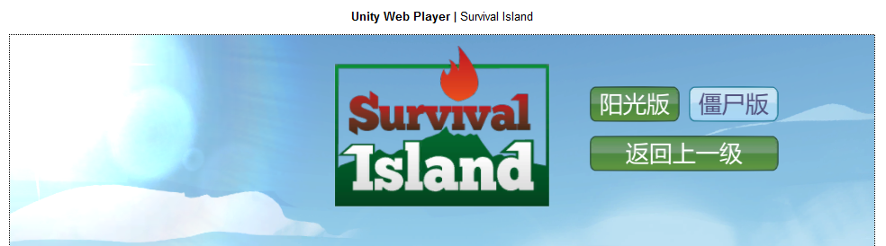

由白色淡入后进入“僵尸版”游戏场景，右上角显示了小岛微型地图以及角色（绿色）和僵尸（红色）的位置
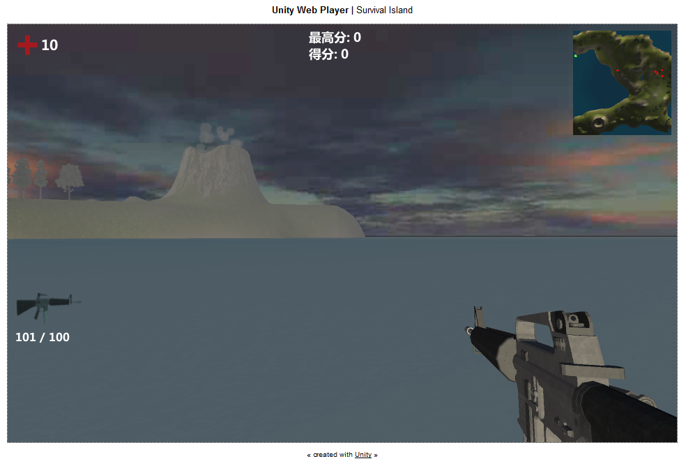

小岛地形为僵尸生成的A星寻路代理对象

看看这里的僵尸——变化为僵尸猴体型变巨大的女护士。。。
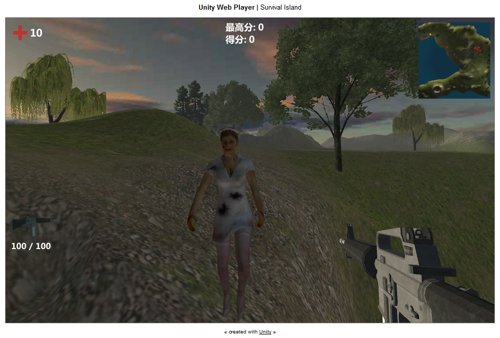

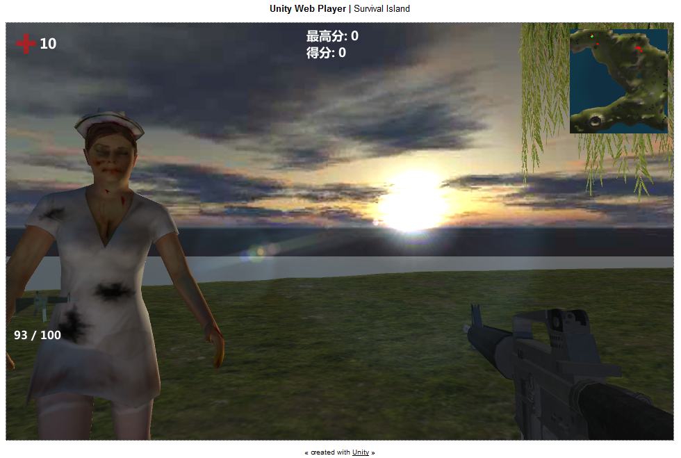

僵尸出生点生成的一大波僵尸正在来袭。。。
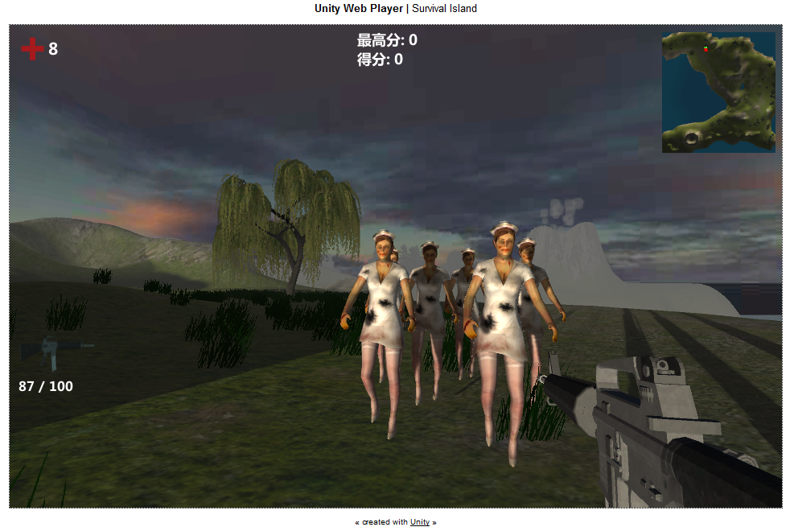

在击杀6个僵尸后获得了600分！
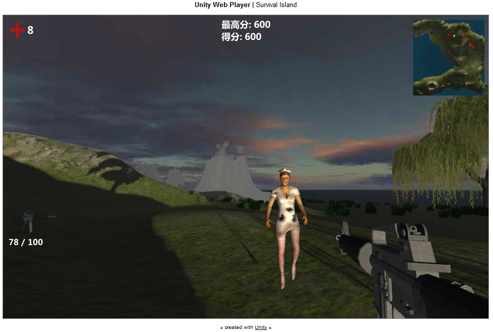

在日光照耀下行走于山坡地形的僵尸
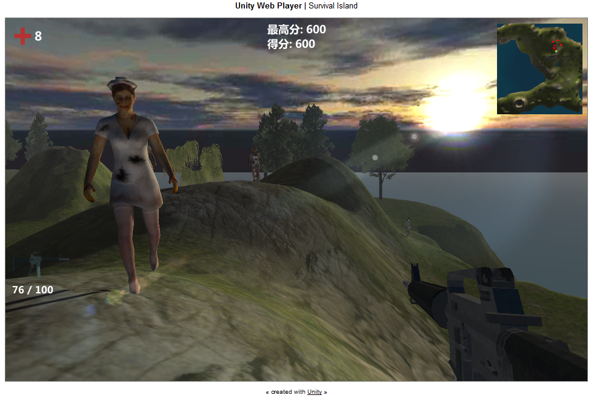

这个光线投影映射出了小屋子以及背后僵尸的背影
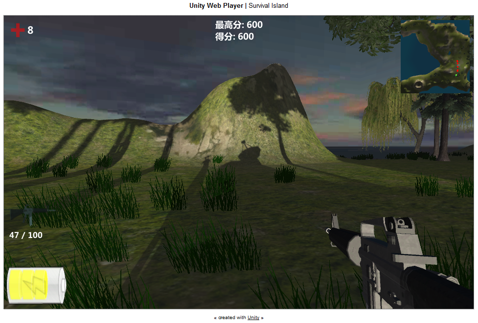

开枪击中僵尸的溅血粒子效果
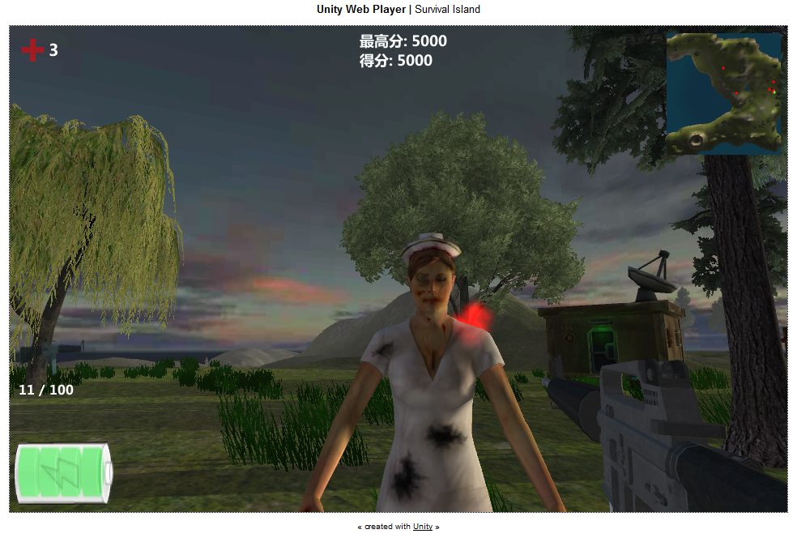

躲在小屋子里面在窗口“爆头”僵尸。。。
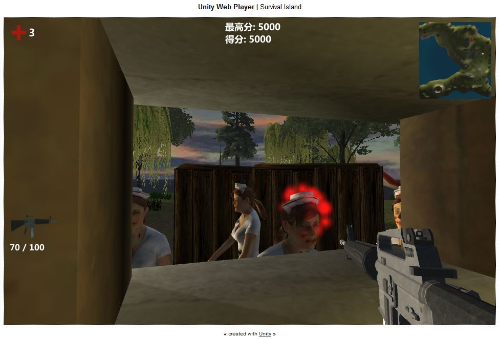

点燃火把后的胜利场景与前作版本一样
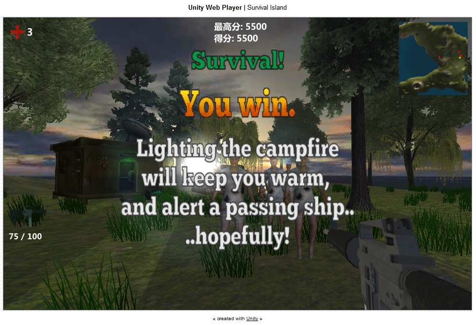

被僵尸挠死后游戏结束！可以点击“再来一次”按钮重新加载“僵尸版”场景再玩一遍！
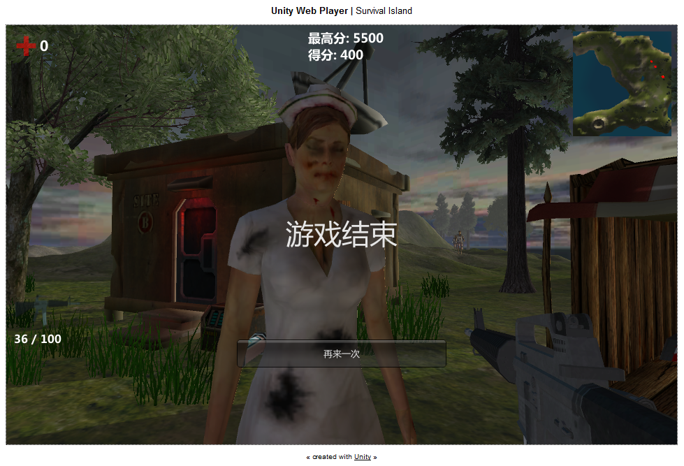

## ToDoList
好吧，其实还有很多地方可以慢慢细化并完善的！

1. 为僵尸头顶添加矩形血条显示血量
2. M16突击步枪的获得以及子弹的获得可以更富有游戏性，例如隐藏在某些富有挑战性的地方
2. 僵尸的模型源自书籍[《Unity3D手机游戏开发》](http://book.douban.com/subject/25704613/)，最好能找一下炫酷吊炸天的模型替换一下，最好有多个僵尸模型，做出多个僵尸，然后提供不同的机动性以及攻击性，没错，目标就是像[《求生之路》](http://baike.baidu.com/link?url=qY-K1ei8rc_I1DjIueba2E3UNVPcBotiQlAyytyMYTcQ80Ew_t4B9WiM_yJazswhub_L_R6yZNe7IG_b56yChPDSd3WEeoldaQuNBWCGQZC)的僵尸般多样化！